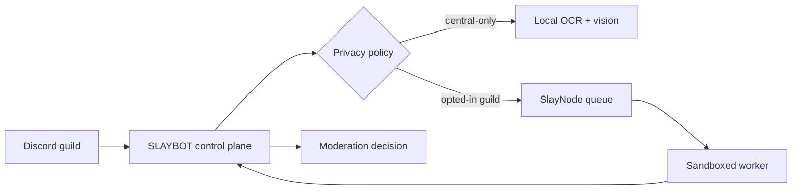

<div align="center">
  <a href="https://discord.gg/6D5ZpJy4Eg">
    
  </a>

  <h1>SLAYBOT v3</h1>
  <p><strong>Умный Discord-бот для порядка, комьюнити и тяжёлых задач без компромиссов по безопасности.</strong></p>

  <p>
    <a href="https://github.com/is2a4c/SLAYBOT/actions/workflows/ci.yml">
      
    </a>
    <a href="https://nodejs.org/">
      
    </a>
    <a href="https://discord.js.org/">
      
    </a>
    <a href="LICENSE">
      
    </a>
  </p>

  <p>
    <a href="https://discord.com/api/oauth2/authorize?client_id=1228720060219129856&scope=bot+applications.commands&permissions=1374891928950"><strong>Пригласить бота</strong></a>
    &nbsp;·&nbsp;
    <a href="https://discord.gg/6D5ZpJy4Eg"><strong>Сервер поддержки</strong></a>
    &nbsp;·&nbsp;
    <a href="docs/SUMMARY.md"><strong>Документация</strong></a>
    &nbsp;·&nbsp;
    <a href="PRIVACY.md"><strong>Privacy</strong></a>
    &nbsp;·&nbsp;
    <a href="TERMS.md"><strong>Terms</strong></a>
  </p>
</div>

> **v3 — это единая платформа для сервера:** обычные и slash-команды, глубокая AutoMod-защита, Smart Invites, локальный анализ изображений с OCR и SlayNode для безопасного распределённого вычисления.

<div align="center">
  <a href="#quick-start">Быстрый старт</a>
  &nbsp;•&nbsp;
  <a href="#what-is-new">Что даёт v3</a>
  &nbsp;•&nbsp;
  <a href="#image-spam">Защита от image spam</a>
  &nbsp;•&nbsp;
  <a href="#slaynode">SlayNode Partner</a>
  &nbsp;•&nbsp;
  <a href="#commands">Команды</a>
  &nbsp;•&nbsp;
  <a href="#operations">Эксплуатация</a>
</div>

---

## <a id="what-is-new"></a>✨ Что даёт v3

| 🛡️ Безопасность по умолчанию                                                                   | 🧠 Локальный интеллект                                                                                       | 🛰️ Вычисления без доверия                                                                                        |
| ---------------------------------------------------------------------------------------------- | ------------------------------------------------------------------------------------------------------------ | ---------------------------------------------------------------------------------------------------------------- |
| Автомодерация, журналирование, предупреждения, гибкие пороги и безопасное fail-open поведение. | OCR на русском и английском + SmolVLM для распознавания финансового image spam прямо в вашей инфраструктуре. | SlayNode разгружает тяжёлые OCR/AI-задачи на подключённые машины, не отдавая им токен бота или доступ к MongoDB. |

| ⚡ Вся жизнь сервера                                                                         | 🎵 Медиа и развлечения                                                                  | 🎛️ Управление без рутины                                                                  |
| -------------------------------------------------------------------------------------------- | --------------------------------------------------------------------------------------- | ----------------------------------------------------------------------------------------- |
| Модерация, тикеты, роли, приветствия, инвайты, статистика, репутация, экономика и розыгрыши. | Lavalink-музыка, поиск, очередь, фильтры, image-команды, игры, аниме-реакции и утилиты. | Prefix, slash и context-команды; серверные настройки хранятся отдельно для каждого guild. |

### Почему это важно

- **Центральный бот остаётся источником истины.** Решение о модерации, Discord gateway, секреты и база данных никогда не покидают основной сервис.
- **Тяжёлые функции не требуют платного AI API.** Модель image spam загружается в локальный cache и запускается только когда нужна.
- **Сервер не становится хрупким.** Если OCR, vision-модель или удалённый worker недоступны, сообщение остаётся нетронутым, а бот продолжает работу.
- **v3 рассчитан на рост.** SlayNode даёт путь от одного процесса к управляемой сети worker-ов с очередью, лимитами и центральным fallback.

---

## <a id="quick-start"></a>⚡ Быстрый старт

### Что понадобится

- **Node.js 18+** — для production рекомендуется Node.js 22.
- **MongoDB** — хранилище конфигурации серверов, статистики, тикетов, инвайтов и очереди SlayNode.
- **Discord application** с bot token и нужными intents.

### Запуск локально

```bash
git clone https://github.com/is2a4c/SLAYBOT.git
cd SLAYBOT
cp example.config.js config.js
cp .env.example .env
npm ci
```

1. Заполните <code>.env</code>: минимум <code>BOT_TOKEN</code> и <code>MONGO_CONNECTION</code>.
2. Проверьте <code>config.js</code>: owner IDs, prefix, нужные модули и параметры interactions.
3. Выполните проверку конфигурации и запустите бота:

```bash
npm run runtime:check
npm start
```

> [!IMPORTANT]
> Не коммитьте <code>.env</code>, <code>config.js</code>, ключи SlayNode или cache моделей. Репозиторий уже исключает локальный <code>config.js</code> из Git.

<details>
  <summary><strong>Полезные переменные окружения</strong></summary>
  <br>

| Переменная                                                         | Для чего нужна                     | Обязательность |
| ------------------------------------------------------------------ | ---------------------------------- | -------------- |
| <code>BOT_TOKEN</code>                                             | Подключение к Discord              | Да             |
| <code>MONGO_CONNECTION</code>                                      | MongoDB для данных бота и SlayNode | Да             |
| <code>ERROR_LOGS</code>, <code>JOIN_LEAVE_LOGS</code>              | Webhooks для журналов              | Нет            |
| <code>SPOTIFY_CLIENT_ID</code>, <code>SPOTIFY_CLIENT_SECRET</code> | Spotify-поиск для музыки           | Нет            |
| <code>STRANGE_API_KEY</code>                                       | Внешние image-команды              | Нет            |
| <code>WEATHERSTACK_KEY</code>                                      | Команда погоды                     | Нет            |

</details>

---

## <a id="image-spam"></a>🧠 Image Spam Guard

v3 умеет анализировать вложенные изображения на мошеннические выплаты, казино/ставки, фальшивые банковские переводы, криптокошельки и схемы с «бесплатными» наградами.

```text
Attachment → image safety limits → OCR (RU + EN) → visual preparation
           → io.net vision classification → score fusion → AutoMod action
```

### Включение в сервере

```text
!anti imagespam on 70
!anti strikes-reset @User
```

- При настроенном <code>IO_INTELLIGENCE_API_KEY</code> изображения анализируются удалённой vision-моделью io.net, поэтому локальный ONNX не нагружает CPU бота.
- Без ключа используется локальный fallback **SmolVLM 500M** в quantized-режиме <code>q4</code>.
- Cache локального fallback по умолчанию: <code>.cache/image-spam</code>. Его можно перенести через <code>IMAGE_SPAM_MODEL_CACHE</code>.
- Локальную fallback-модель можно прогреть вручную, но это **не требуется** для старта: загрузка ленивая.

```bash
npm run image-spam:model:download
npm run image-spam:check
```

> [!NOTE]
> Image Spam Guard сознательно работает в режиме **fail-open**: сомнительное или неуспешно обработанное изображение не удаляется автоматически. Настройте порог под правила конкретного сервера.

### Whitelist повторяющихся сообщений

Пользователей и роли, которым нужно легитимно отправлять одинаковый текст (например, Discord-ботов и webhook-системы уведомлений), можно вручную исключить только из проверки Anti Spam:

```text
!anti spam-whitelist user add @NotificationBot
!anti spam-whitelist role add @Trusted

/anti spam-whitelist-user action:ADD user:@NotificationBot
/anti spam-whitelist-role action:ADD role:@Trusted
/anti strikes-reset user:@User
```

Whitelist не отключает AutoMod целиком: Anti Links, Anti Invites, Anti Attachments, Anti Mass Mention, Image Spam, лимиты строк и упоминаний, а также остальные проверки продолжают работать. Автоматически все боты в whitelist не добавляются. Для управления требуется право **Manage Server** (`ManageGuild`); полный список команд находится в [документации администратора](docs/commands/admin.md#anti-spam-whitelist).

---

## <a id="slaynode"></a>🛰️ SlayNode Partner

**SlayNode Partner** — распределённый слой вычислений для OCR, image и AI-задач. Это не «копия бота» на чужой машине: worker получает только строго разрешённый job envelope и не видит токен Discord, строку MongoDB или центральные ключи.



### Что получает сервер

| Возможность          | Как работает                                                                                                                                                                 |
| -------------------- | ---------------------------------------------------------------------------------------------------------------------------------------------------------------------------- |
| **Guild affinity**   | Работа конкретного сервера в первую очередь уходит на его собственные nodes.                                                                                                 |
| **Privacy classes**  | <code>PUBLIC</code> и <code>ANONYMIZED</code> безопасны по умолчанию; <code>GUILD_PRIVATE</code> требует явного opt-in; <code>CENTRAL_ONLY</code> не отправляется worker-ам. |
| **Надёжная очередь** | Состояния <code>QUEUED → LEASED → SUCCEEDED</code>, leases, idempotency, exponential backoff и central fallback.                                                             |
| **Изоляция**         | Non-root контейнеры, read-only FS, ограничения CPU/RAM/PID, child process с timeout и без удалённого shell.                                                                  |
| **Slay Credits**     | Проверенные jobs записываются в защищённый ledger и формируют Partner tier: Bronze, Silver, Gold, Platinum.                                                                  |

### Подключение worker-а

SlayNode состоит из двух частей:

- **Control plane** работает внутри основного SLAYBOT, хранит очередь в MongoDB и принимает решение, какие задания можно передать наружу.
- **Worker** работает на отдельной машине в изолированном Docker-контейнере, сам подключается к control plane по HTTPS и выполняет только разрешённые OCR/vision jobs.

Worker-у не нужны Discord token, MongoDB URL и исходный `config.js`.

#### 1. Подготовьте основной SLAYBOT

В `config.js` на сервере бота включите control plane:

```js
SLAYNODE: {
  enabled: true,
  host: "127.0.0.1",
  port: 8090,
}
```

Создайте отдельный master key и передайте его основному процессу SLAYBOT:

```bash
openssl rand -base64 48
# сохраните результат как SLAYNODE_MASTER_KEY в environment/vault
```

Если используется встроенный GitHub Actions deploy, добавьте результат как repository/environment secret `SLAYNODE_MASTER_KEY`. Не меняйте его при обычных обновлениях: им шифруются credentials уже подключённых worker-ов.

Опубликуйте локальный порт `8090` через HTTPS reverse proxy. Не открывайте HTTP control plane напрямую в интернет. Проверка готовности должна возвращать HTTP 200:

```bash
curl -fsS https://node-control.example/ready
```

#### 2. Создайте одноразовый token

На Discord-сервере выполните `/slaynode enroll`. Команда доступна участнику с правом **Manage Server** и выдаёт token на 15 минут. Он применяется только один раз.

#### 3. Установите worker через Docker

Требования к машине worker-а:

- Docker Engine 24+ и Docker Compose v2;
- 2 CPU, 4 GB RAM и около 5 GB свободного диска;
- исходящее HTTPS-соединение с control plane;
- Linux x86_64/arm64. GPU необязателен.

Скачайте и запустите единый installer:

```bash
curl -fsSLO https://raw.githubusercontent.com/is2a4c/SLAYBOT/main/scripts/install-slaynode.sh
chmod +x install-slaynode.sh
./install-slaynode.sh
```

Installer спросит HTTPS URL control plane и одноразовый token. Затем он:

1. скачает актуальные исходники SlayNode;
2. локально соберёт non-root Docker image;
3. выполнит enrollment внутри одноразового контейнера;
4. сохранит уникальные `SLAYNODE_ID` и `SLAYNODE_SECRET` в `.env` с правами `0600`;
5. создаст постоянный volume для моделей;
6. запустит worker и дождётся реального heartbeat до статуса `healthy`.

Для автоматической установки без вопросов:

```bash
SLAYNODE_CONTROL_URL=https://node-control.example \
SLAYNODE_ENROLLMENT_TOKEN='token-from-discord' \
SLAYNODE_INSTALL_DIR=/opt/slaynode \
./install-slaynode.sh
```

> [!IMPORTANT]
> Не передавайте `.env` другой ноде. Каждый worker должен получить собственный token через `/slaynode enroll` и собственную пару credentials.

#### Эксплуатация

По умолчанию файлы находятся в `./slaynode-worker`:

```bash
cd slaynode-worker
docker compose -f docker-compose.slaynode.yml ps
docker compose -f docker-compose.slaynode.yml logs -f slaynode
docker compose -f docker-compose.slaynode.yml restart slaynode
```

Повторный запуск installer-а обновляет код и image, но сохраняет существующие credentials и model cache. Для плановой ротации secret используйте `/slaynode rotate`, замените `SLAYNODE_SECRET` в `.env` и перезапустите контейнер.

Остановить worker:

```bash
docker compose -f docker-compose.slaynode.yml down
```

Удаление с `down -v` дополнительно уничтожит загруженный model cache. Файл `.env` удаляется отдельно вручную только при окончательном выводе ноды из эксплуатации.

#### Как проходит job

1. Worker отправляет подписанный heartbeat и просит lease.
2. Control plane выбирает job по capability, privacy class и guild affinity.
3. Worker запускает allowlisted executor в отдельном child process с memory limit и timeout.
4. Результат возвращается через подписанный `ack`; ошибка — через `nack`, после чего очередь применяет retry/backoff.
5. Control plane проверяет результат, записывает audit/credits и при необходимости выполняет central fallback.

Docker healthcheck становится успешным только после связи с control plane и становится unhealthy, если heartbeat устарел. Контейнер работает без root, с read-only filesystem, без Linux capabilities, с CPU/RAM/PID limits и ограниченной ротацией логов.

Полное описание протокола, privacy classes, monitoring и модели угроз — в [архитектуре SlayNode](docs/slaynode/architecture.md).

---

## <a id="commands"></a>🎮 Карта команд

В репозитории **140 command modules** в 16 категориях. Полный список и актуальные параметры — в документации; ниже — удобная карта возможностей v3.

| Пространство           | Что внутри                                                                                                        | Документация                                                                      |
| ---------------------- | ----------------------------------------------------------------------------------------------------------------- | --------------------------------------------------------------------------------- |
| 🛡️ **Admin & AutoMod** | anti spam, image spam, ghost ping, mass mention, whitelist, actions, modlog, auto-delete, roles, welcome/farewell | [Admin](docs/commands/admin.md)                                                   |
| 🔨 **Moderation**      | warn, timeout, kick, ban, purge по фильтрам, voice moderation, nicknames                                          | [Moderation](docs/commands/moderation.md)                                         |
| 🛰️ **SlayNode**        | enrollment, privacy policy, node health, limits, credits, tiers, rotation и audit log                             | [Architecture](docs/slaynode/architecture.md)                                     |
| 🎫 **Server workflow** | тикеты, предложения, reaction roles, giveaways, invite tracking и постоянные Smart Invites                        | [Giveaways](docs/commands/giveaways.md) · [Invites](docs/commands/invites.md) · [Smart Invites](docs/smart-invites.md) |
| ✨ **Engagement**       | starboard, sticky-сообщения, опросы, напоминания, дни рождения, верификация с капчей, modmail, Twitch/YouTube/RSS/GitHub алерты, события, бэкапы, вебхуки, статус-страница | [Engagement](docs/engagement.md) |
| 🎭 **Роли**            | self-role панели (кнопки и меню), временные роли, voice-роли, restore roles, reaction roles                        | [Admin](docs/commands/admin.md#role-automation) |
| 📈 **Community**       | XP, глобальные сезоны, серверные кубки, постоянные титулы, сезонные призы, общая экономика, daily и gamble         | [Stats](docs/commands/stats.md) · [Economy](docs/commands/economy.md)             |
| 🎵 **Media**           | play, queue, search, seek, filters, Spotify support и Lavalink                                                    | [Music](docs/commands/music.md)                                                   |
| 🖼️ **Creative**        | filters, overlays и генераторы изображений                                                                        | [Image](docs/commands/image.md)                                                   |
| 🧰 **Everyday tools**  | help, translation, weather, GitHub profile, bigemoji, paste, info                                                 | [Utility](docs/commands/utility.md) · [Information](docs/commands/information.md) |
| 🎲 **Fun**             | games, memes, animals, facts, Discord Activities и anime reactions                                                | [Fun](docs/commands/fun.md) · [Anime](docs/commands/anime.md)                     |

### Три быстрых сценария

<details>
  <summary><strong>🛡️ Настроить безопасный сервер за 10 минут</strong></summary>
  <br>

1. Задайте лог-канал: <code>!modlog #moderation-log</code>.
2. Настройте action и strikes через <code>!automodconfig</code>.
3. Включите нужные защиты: anti spam, anti invites, anti ghostping, anti massmention.
4. Добавьте whitelist для служебных каналов.
5. Включите <code>!anti imagespam on 70</code> после проверки модели.

</details>

<details>
  <summary><strong>🎟️ Собрать self-service для комьюнити</strong></summary>
  <br>

Объедините welcome/farewell, autorole, reaction roles, ticket categories, suggestions, формы-опросники (<code>!form create</code>), invite ranks, giveaways и XP leaderboard. Все настройки изолированы на уровне конкретного Discord-сервера.

</details>

<details>
  <summary><strong>🎵 Включить музыкальный режим</strong></summary>
  <br>

Оставьте <code>MUSIC.enabled</code> включённым, настройте доступный Lavalink node в <code>config.js</code> и при необходимости добавьте Spotify credentials в <code>.env</code>.

</details>

---

## <a id="operations"></a>🧰 Эксплуатация и качество

### Команды разработчика

| Команда                               | Назначение                                                    |
| ------------------------------------- | ------------------------------------------------------------- |
| <code>npm test</code>                 | Запустить unit-тесты.                                         |
| <code>npm run lint</code>             | Проверить JavaScript через ESLint.                            |
| <code>npm run format:check</code>     | Проверить форматирование Prettier.                            |
| <code>npm run runtime:check</code>    | Убедиться, что runtime-конфигурация корректна.                |
| <code>npm run image-spam:check</code> | Проверить локальный pipeline image spam.                      |
| <code>npm run image-spam:e2e</code>   | Запустить E2E-проверку image spam при настроенном test image. |
| <code>npm run slaynode:worker</code>  | Запустить worker напрямую.                                    |
| <code>npm run slaynode:e2e</code>     | Проверить SlayNode end-to-end.                                |

### Production checklist

- [ ] Секреты доступны только в environment или vault, а не в репозитории.
- [ ] MongoDB защищён сетевой политикой и резервным копированием.
- [ ] Для SlayNode control plane настроен HTTPS reverse proxy.
- [ ] Для Smart Invites проверены DNS, выпущенный TLS-сертификат, reverse proxy и закрытый от внешней сети локальный port.
- [ ] `SMART_INVITES.baseURL` использует канонический HTTPS URL; Privacy/Terms и abuse contact доступны.
- [ ] MongoDB backup включает `smart_invites` и `smart_invite_controls`, а Discord-бот имеет права в выбранных каналах.
- [ ] У worker-ов есть CPU/RAM limits и отдельные credentials.
- [ ] Перед релизом проходят <code>npm test</code>, <code>npm run lint</code> и <code>npm run runtime:check</code>.
- [ ] Порог image spam и automod action протестированы на правилах вашего сообщества.

---

## 🗂️ Структура проекта

```text
src/
├── commands/        16 категорий команд
├── handlers/        Discord-события и бизнес-логика
├── services/        image spam classifier и сервисы
├── slaynode/        control plane, protocol и executors
├── database/        Mongoose schemas и persistence
└── helpers/         конфигурация, validation, logging и utilities

slaynode/             worker runtime и enrollment CLI
scripts/              проверки runtime, image spam и E2E
test/                 unit и protocol-тесты
docs/                 команды, guides и архитектура
```

## 🤝 Вклад в проект

1. Создайте ветку с понятным названием.
2. Добавьте или обновите тесты для изменения поведения.
3. Запустите checks из раздела выше.
4. Опишите, как проверить изменение, в pull request.

Если нашли уязвимость, не публикуйте детали в issue — используйте [Security Policy](SECURITY.md).

## 📄 Лицензия

Проект распространяется на условиях, указанных в [LICENSE](LICENSE).

## ⚖️ Правовые документы

- [Политика конфиденциальности](PRIVACY.md)
- [Условия использования](TERMS.md)

<div align="center">
  <sub>SLAYBOT v3 · moderation, community and secure compute for Discord</sub>
</div>
